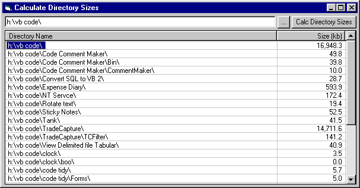

<div align="center">

## List Directories and their sizes\!


</div>

### Description

Ever looked at your C:\ drive and wondered where that 1.8gb have gone?!?!!? here's your answer - this app will list the directory you choose and all it's subdirectories, with their sizes so you can see how much room each directory take up! Please vote - I find it really helpful as windoze won't help you with this!!! please vote and comment
 
### More Info
 


<span>             |<span>
---                |---
**Submitted On**   |2003-03-20 16:50:54
**By**             |[Fosters](https://github.com/Planet-Source-Code/PSCIndex/blob/master/ByAuthor/fosters.md)
**Level**          |Intermediate
**User Rating**    |4.6 (23 globes from 5 users)
**Compatibility**  |VB 4\.0 \(32\-bit\), VB 5\.0, VB 6\.0
**Category**       |[Complete Applications](https://github.com/Planet-Source-Code/PSCIndex/blob/master/ByCategory/complete-applications__1-27.md)
**World**          |[Visual Basic](https://github.com/Planet-Source-Code/PSCIndex/blob/master/ByWorld/visual-basic.md)
**Archive File**   |[List\_Direc1562483212003\.zip](https://github.com/Planet-Source-Code/fosters-list-directories-and-their-sizes__1-44146/archive/master.zip)

### API Declarations

```
Declare Function FindFirstFile Lib "kernel32" Alias "FindFirstFileA" (ByVal lpFileName As String, lpFindFileData As WIN32_FIND_DATA) As Long
Declare Function FindNextFile Lib "kernel32" Alias "FindNextFileA" (ByVal hFindFile As Long, lpFindFileData As WIN32_FIND_DATA) As Long
Declare Function GetFileAttributes Lib "kernel32" Alias "GetFileAttributesA" (ByVal lpFileName As String) As Long
Declare Function FindClose Lib "kernel32" (ByVal hFindFile As Long) As Long
Declare Function FileTimeToLocalFileTime Lib "kernel32" (lpFileTime As FILETIME, lpLocalFileTime As FILETIME) As Long
Declare Function FileTimeToSystemTime Lib "kernel32" (lpFileTime As FILETIME, lpSystemTime As SYSTEMTIME) As Long
Declare Function SHGetPathFromIDList Lib "shell32.dll" Alias "SHGetPathFromIDListA" (ByVal pidl As Long, ByVal pszPath As String) As Long
Declare Function SHGetSpecialFolderLocation Lib "shell32.dll" (ByVal hwndOwner As Long, ByVal nFolder As Long, pidl As ITEMIDLIST) As Long
Declare Function SHBrowseForFolder Lib "shell32.dll" Alias "SHBrowseForFolderA" (lpBrowseInfo As BROWSEINFO) As Long 'ITEMIDLIST
Private Declare Function ShowScrollBar Lib "user32" (ByVal hwnd As Long, ByVal wBar As Long, ByVal bShow As Long) As Long
```


